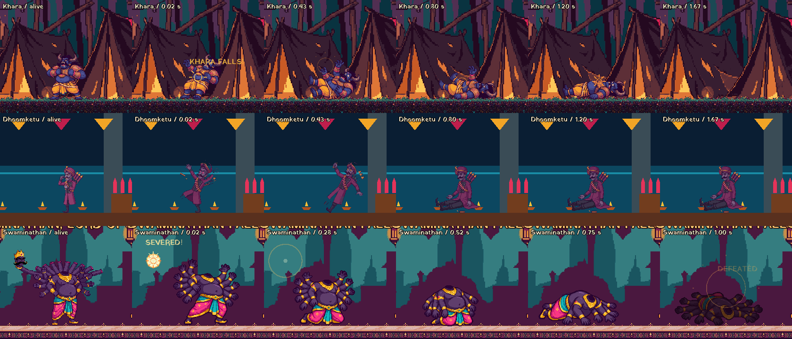

# Boss death playback

All three bosses have existing death images. Lethal damage empties the shared
health bar and disables damage and hazards immediately. `died` now announces
the end of the visible death sequence, so victory controls, campaign exits
and Raj's rescue wait for the collapse. Pause suspends playback.

| Boss | Existing art | Playback |
| --- | --- | --- |
| Khara | `assets/sprites/khara/death/01.png` to `04.png` | Four poses over 1.4 s, including a held fallen pose, then removal. The lethal hit flash clears so the art retains its own colors. |
| Dhoomketu | Runtime images and sprite resource from local `feat/dhoomketu-sprites`, commits `64cd3f5` and `e9dac9c` | Four frames over 1.55 s, then a held seated slump. His existing idle, intro, attack and reload art is included so death uses the same character as the fight. Attack timing and collision rules are preserved. |
| Swaminathan | `assets/sprites/swaminathan/dying/01.png` to `04.png`, then `dead/01.png` | Four collapse poses over the existing 0.9 s death duration, then a dimmed corpse. Living head-count art and attack origins remain shared with the fight. |

## Remaining art gaps

Dhoomketu's `death/04.png` is identical to `death/03.png`: the seated slump is
held longer. Its metadata describes a lying-flat pose, but that distinct image
has not been created in the available set. Several attack follow-through
frames are also held duplicates, and phase shift uses the idle pose with the
existing red tint. This integration reuses the available art without generating
replacement images.

## Review and verification

The relevant boss suites exercise every death pose, deferred victory,
immediate hazard cleanup, ignored extra damage, pause and final-pose behavior.
`tests/campaign_flow_check.gd` verifies that Enter cannot skip dying bosses and
that campaign exits and Raj's rescue wait for completion.

Verified with Godot 4.7.2: all 39 suites in `python tools/run_checks.py` pass.
The Linux smoke pack exports and launches outside the project, and
`tools/pack_check.gd` passes all 19 packed scenes. The in-engine screenshots
below were rendered and inspected for pose progression and feet alignment.

Render real playback in all three isolated arenas with:

```sh
xvfb-run -a godot --path . --fixed-fps 60 --resolution 960x540 \
  --script tools/boss_death_shots.gd -- --silent-audio
```

The tool produces the comparison below and full arena screenshots under
`docs/screenshots/boss-deaths/`. Columns show alive, four death beats and
the completed sequence. Swaminathan starts with his last living head.


