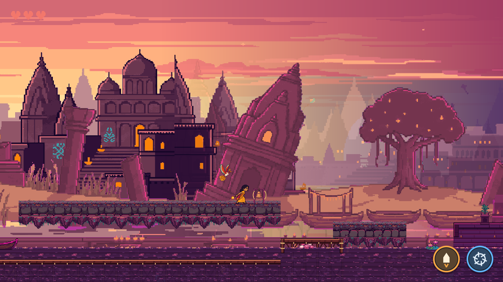

# Interactive scenery

Siya's sparkler lash now rings the four existing river bells and taps two pottery
decorations. Use the named `attack` action, J by default, facing the prop and
within normal lash reach. Ground and aerial lashes work during their active
window. Other weapons and enemy attacks leave these decorations alone.

The bells play the existing short `ui.wav` chime through the SFX bus, wobble and
show expanding gold sound rings. Pottery plays `hit.wav`, wobbles and shows a
short impact arc. Each prop waits 0.8 seconds before accepting another hit.
The shared AudioDirector also bounds voices and attenuates distant sounds.
Feedback lasts 0.65 seconds and restores the original art offset.

All six instances are authored in `scenes/levels/river.tscn`, under
`Decor/titlematch/Props`. They keep the existing approved art and placements.

| Decoration | River x | Location |
| --- | ---: | --- |
| `bell_arch_1` | 4419.5 | Dock platform before the lower crossing |
| `bell_stand_1` | 6024.8 | Raised temple approach |
| `pot_1` | 10021.2 | Long ghat platform |
| `pots_two_1` | 10227.5 | Long ghat platform, beside the single pot |
| `bell_arch_2` | 10409.5 | Far end of the same ghat platform |
| `bell_stand_2` | 14304.8 | Final temple steps |

These are optional reactions. They grant no health, ammunition or progress, use
no `interact` input and create no solid collision. Diyas, bridge planks,
checkpoints and traversal retain their existing behavior.

`scripts/levels/interactive_scenery.gd` attaches directly to an existing Sprite2D
and creates an Area2D sensor on physics layer 6, bit 32. Its exported hit center
and size use the texture's art coordinates; the sprite's existing 0.5 scale
converts them to game units. `melee_attack.gd` makes a separate scenery area
query using its existing active hit rectangle, after its unchanged enemy body
query. Both queries use the swing's per-target deduplication.

`tests/interactive_scenery_check.gd` checks the actual campaign instances with
named attack input and real physics. It covers platform reach, both facing
directions, windup and cancellation, cooldown and rearming, hidden art, enemy
swings, an enemy overlapping a bell, audio playback and unchanged level progress.

## Validation

Validated with the existing Godot 4.7.2 installation. The new scenery suite
passes, and the final full regression run passes 36 of 37 suites.
`robin_check.gd` has six tutorial assertions that also fail with the changed
combat and river files restored to starting commit `6b15432`.

The smoke PCK exports and launches outside the repository; its packed-resource
check passes across 19 scenes. Scripted rendered playtests cover both bell art
variants and the paired pots. The screenshot above shows the expanding bell
rings after a real named-input lash. Playback is checked through the actual
AudioDirector voice pool; subjective sound balance and a manual campaign
playthrough have not been assessed.

Integration touches the shared melee query and the authored river decorations.
Reserve physics layer 6 for these optional scenery sensors. No main scene,
diya healing, fireworks or existing art asset changes are included.
