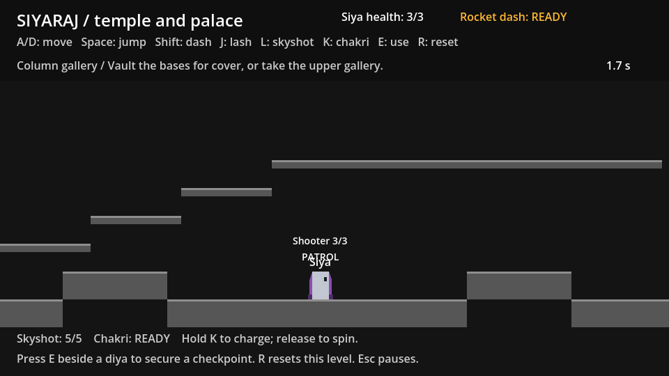
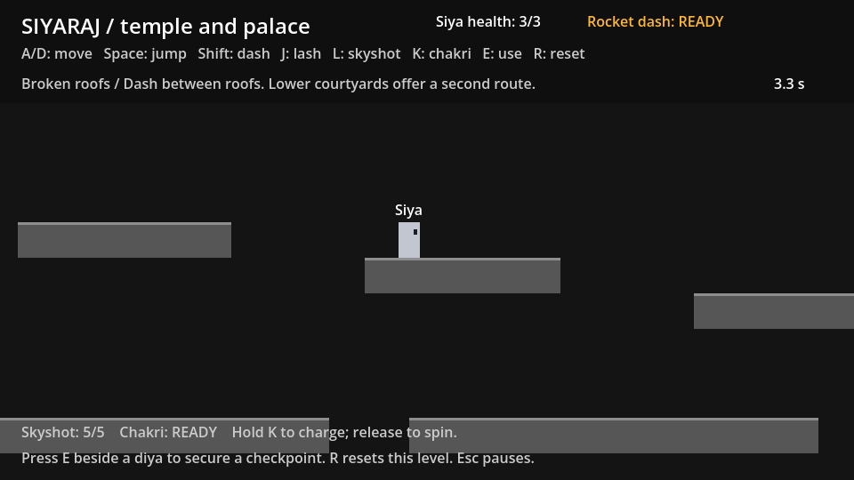
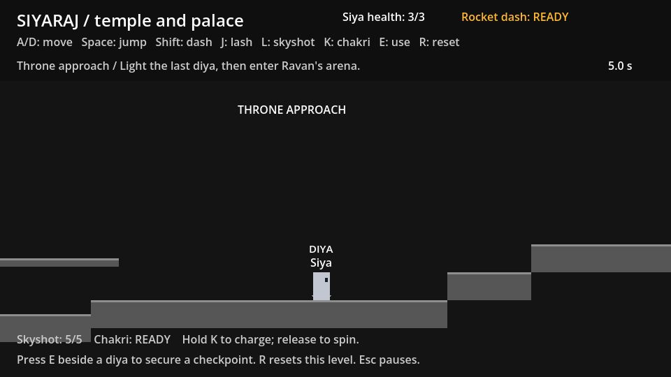

# Palace traversal and encounters

The palace keeps the 14400 px length and five existing manual E checkpoints. Native grey geometry lives in `scenes/levels/palace.tscn`. The primary route has 43 platforms under `Terrain`; 25 optional platforms live under `AlternateRoutes`. Player, enemy and weapon settings are unchanged.

| Section | What to playtest |
| --- | --- |
| Gate, 0 to 3260 | A stepped gate and broken lintel lead into a broad brute courtyard. Lower ledges catch a missed lintel jump and reconnect to the court. |
| Column gallery, 3260 to 5540 | Two 40 px column bases interrupt the ground shooter's sightline. Vault and dash into melee, interrupt its charge with skyshot, or climb the one-way gallery steps and bypass it above. The upper route reconnects before the diya. |
| Broken roofs, 5540 to 8910 | A high lookout shows the descending roof chain. Lower recovery courts let a missed jump become a second route rather than an immediate death. A guard waits on the wide landing with space to dash through its swing. |
| Inner hall, 8910 to 11260 | Column bases separate the guard court from the shooter's hall. A second balcony lets players cross above both fights and choose where to drop. Melee remains possible on the entire lower route. |
| Sanctum, 11260 to 13400 | Five steps lead to a broad raised brute platform. The final roofs descend toward the throne; lower recovery ledges reconnect at the last checkpoint. |
| Throne approach, 13400 to 14400 | An enemy-free diya pocket precedes the throne stairs and exit. Campaign integration sends the player to the existing Swaminathan arena after completing this approach. |

The five diya positions remain `(3060,430)`, `(5340,430)`, `(8600,430)`, `(11060,430)` and `(13600,430)`, preserving developer snapshot starts. Enemy patrol and detection ranges remain outside those pockets. No encounter requires ammo or a ready chakri. Upper routes are optional; the ordinary ground route reaches every enemy.

`tests/palace_layout_check.gd` traverses every primary connection and optional stair/roof connection with the actual player controller. It checks grounded E checkpoint interaction, enemy footing and checkpoint separation, column line-of-sight protection, and a real grounded J hit against the gallery shooter. Physics probes establish reachability; continuous human playtests should assess whether the choices are apparent and whether combat spacing needs adjustment.

Rendered Godot views were checked at the gallery, roofs and final checkpoint.

